Advancing with data visualization in R using `ggplot2`
================

**By [Christine Zhang](https://twitter.com/christinezhang) (ychristinezhang at gmail dot com)**<br> *Storytelling with Data Workshop at Boston University (June 8, 2017)*
<br><br> Data visualization is a popular aspect of R, since R can create sophisticated graphics with (relatively few) lines of code. `ggplot2` is one of the most popular graphics packages. `ggplot2` is named for the **Grammar of Graphics**, a concept first popularized by [Leland Wilkinson](https://www.amazon.com/Grammar-Graphics-Statistics-Computing/dp/0387245448). The `ggplot2` package was developed by [Hadley Wickham](http://hadley.nz/), with the goal of providing a structured approach to graphing. As he wrote in 2012:

> "The emphasis in ggplot2 is reducing the amount of thinking time by making it easier to go from the plot in your brain to the plot on the page."

You can read more about the Grammar of Graphics philosophy [here](A%20Layered%20Grammar%20of%20Graphics).

One of the advantages of `ggplot2` is its versatility in creating different types of graphs. This is important because good data visualization involves making the best choices for showcasing a given dataset. Depending on the question you're trying to answer, these choices could be very different, even if you have the same data.

*FlowingData* blogger and statistician Nathan Yau made this point with a post earlier this year called ["One Dataset, Visualized 25 Ways"](http://flowingdata.com/2017/01/24/one-dataset-visualized-25-ways/) (January 24, 2017). He took World Health Organization data on life expectancy by country from 2000 to 2015 and produced 25 different charts (some more useful than others). The blog post was also covered by *Wired* magazine in an article, "25 Visualizations Spin the Same Data Into 25 Different Tales" (February 9, 2017), which you can read [here](https://www.wired.com/2017/02/25-visualizations-spin-data-25-different-tales/).

In this workshop, we will:

-   Examine the basic syntax of `ggplot2`
-   Use global life expectancy data to produce different type of plots charts using `ggplot2`
-   Explore advanced features of `ggplot2`
-   Learn to export graphics for publication

### Loading `ggplot2`

First, let's load the `ggplot2` package.

``` r
# install.packages('ggplot2') # if you don't already have ggplot2
library('ggplot2') # load the ggplot2 package
```

### The syntax of `ggplot2`

A `ggplot2` graph is built up from a few basic elements:

-   **Data**: the raw data you want to plot.
-   **Aesthetic mappings**: e.g., which variable is on the x-axis? the y-axis? Should the color/size/position of the plotted data that be mapped to some variable?
-   **Geometries**: the geometric shapes that represent the data
-   **Statistics**: statistical transformations that are used to summarize the data

These elements can be customized to make a variety of `ggplot2` graphics.

Let's take a look at a simple example. In the previous session you used `qplot()` to make a quick scatter plot of drivers killed by year in Great Britain. Let's do this again.

Make the `ts` time-series dataframe:

``` r
# Make a dataframe 
data(Seatbelts)
s <- as.data.frame(Seatbelts)

# Add in time-series data 
ts <- data.frame(Year=floor(time(Seatbelts)),
                 Month=factor(cycle(Seatbelts),
                              labels=month.abb), Seatbelts)
```

`qplot()` stands for "quick plot" and is the quick and simple plotting function of `ggplot2`.

``` r
# Now, let's plot the data, using the basic plotting function of ggplot2 
qplot(data = ts, x = Year, y = DriversKilled, main = 'Drivers Killed by Year')
```


Let's try making the same plot using the `ggplot()` function instead of `qplot()`.

First, we create the ggplot object. Let's call it `drivers.plot`:

``` r
drivers.plot <- ggplot(data = ts, # the data
       aes(x = Year, # 'aes' stands for 'aesthetics': what's on the x- and y- axes
           y = DriversKilled))
```

**Is this enough to generate the plot?**

Let's take a look by calling the `drivers.plot` object:

``` r
drivers.plot
```

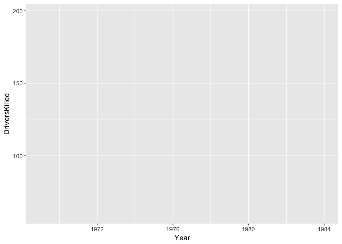

The graph is blank, although it does contain the correct axes for `Year` and `DriversKilled`. This is because we have mapped these using the `aes()` function to the x- and y- axes, respectively.

What's missing is the layer for **Geometry**, or what kind of geometric object we want to draw. `qplot()` automatically determines the geometry, but `ggplot()` requires you to specify it. `geom_point()` is the function for creating a scatter plot.

``` r
drivers.plot + geom_point() # adding geometry layer
```

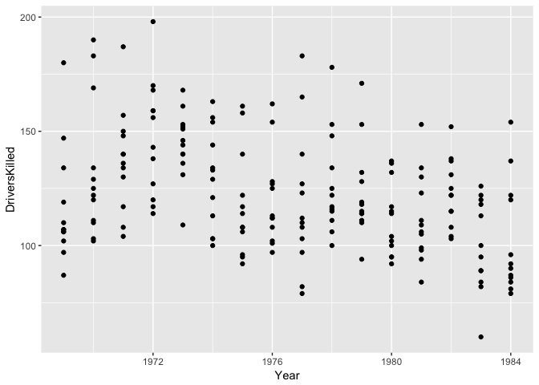

The simplest form of a `ggplot()` graphic is one that has a ggplot object, with an added geometry layer. `data =` and `aes()` are the data and aesthetics mappings that tell R what data to plot and how.

Instead of `geom_point()` we could use `geom_text()`

``` r
drivers.plot + 
  geom_text(aes(label = Month))
```

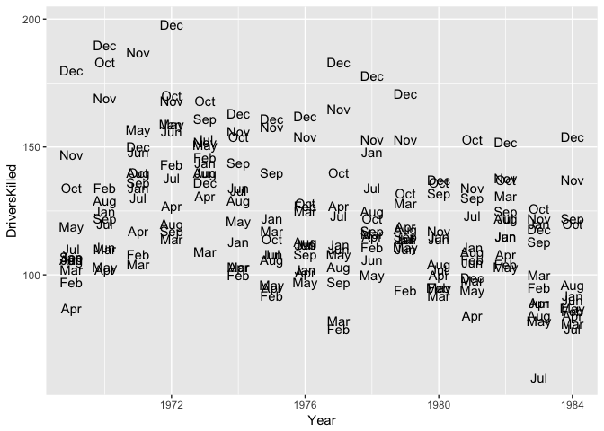

We can add a title by adding a `ggtitle()` layer.

``` r
drivers.plot + geom_point() + ggtitle('Drivers Killed by Year')
```

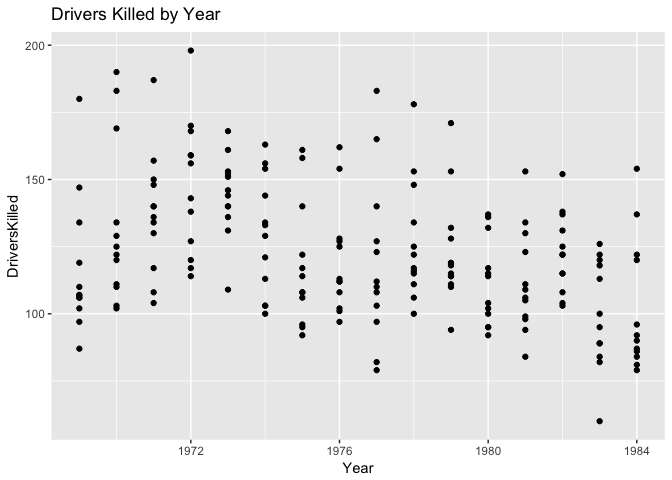

A common practice to simplify the code is to save the `ggplot()` object as a separate R object, as we did above by creating `drivers.plot`. Then, we can add layers onto this object. We'll do this occasionally throughout this workshop.

Let's review `qplot()` and `ggplot()`:

``` r
# These produce the exact same plot:
qplot(data = ts, x = Year, y = DriversKilled, main = 'Drivers Killed by Year')
```


``` r
ggplot(data = ts, 
       aes(x = Year, y = DriversKilled)) + 
  geom_point() + 
  ggtitle('Drivers Killed by Year') 
```


So the full form, `ggplot()`, is a lot more verbose than `qplot()`. But it is cleaner and allows for greater customization.

To see what I mean, let's move on to a real-life dataset that showcases some more interesting trends.

### Life expectancy by country, 2000 to 2015

Let's load in a dataset of life expectancy by country (and the global average) between 2000 and 2015, downloaded from the [World Health Organization](http://apps.who.int/gho/data/view.main.SDG2016LEXv?lang=en).

Note the use of `stringsAsFactors = F` here inside the `read.csv()` function. We'll come back to factors later (or if you really want, feel free to read a short essay/rant about it [here](https://simplystatistics.org/2015/07/24/stringsasfactors-an-unauthorized-biography/)), but try running the code without this argument and see what happens.

``` r
life <- read.csv('life.csv', stringsAsFactors = F)
str(life)
```

    ## 'data.frame':    2944 obs. of  8 variables:
    ##  $ year        : int  2000 2000 2000 2000 2000 2000 2000 2000 2000 2000 ...
    ##  $ region.code : chr  "AFR" "AFR" "AFR" "AFR" ...
    ##  $ region      : chr  "Africa" "Africa" "Africa" "Africa" ...
    ##  $ country.code: chr  "AGO" "BDI" "BEN" "BFA" ...
    ##  $ country     : chr  "Angola" "Burundi" "Benin" "Burkina Faso" ...
    ##  $ both.sexes  : num  45.3 50.8 55.4 50.1 47.8 ...
    ##  $ female      : num  46.8 53 56.6 51.3 47.7 ...
    ##  $ male        : num  43.8 48.6 54 48.8 47.9 ...

We can take a look at the data using `head()`:

``` r
head(life)
```

    ##   year region.code region country.code                  country both.sexes
    ## 1 2000         AFR Africa          AGO                   Angola   45.27850
    ## 2 2000         AFR Africa          BDI                  Burundi   50.81271
    ## 3 2000         AFR Africa          BEN                    Benin   55.35547
    ## 4 2000         AFR Africa          BFA             Burkina Faso   50.14030
    ## 5 2000         AFR Africa          BWA                 Botswana   47.80388
    ## 6 2000         AFR Africa          CAF Central African Republic   45.96999
    ##     female     male
    ## 1 46.82682 43.75179
    ## 2 53.04137 48.63932
    ## 3 56.55630 54.04985
    ## 4 51.34976 48.82209
    ## 5 47.67078 47.85654
    ## 6 47.06387 44.86312

### Scatter plots

**Exercise: fill in the blanks to create a scatter plot of female life expectancy (y-axis) versus male life expectancy (x-axis)**

``` r
ggplot(_____, aes(x = ______, y = _____)) +
  _____
```

Let's take a look at just the United States. We can use the `filter()` function in the `dplyr` package to filter the `life` dataframe accordingly. We'll call it `life.usa`.

``` r
# install.packages('dplyr') # if you don't already have the package
library('dplyr') # load the dplyr package
life.usa <- life %>% filter(country.code == 'USA')
```

We can see the life expectancy of males versus females in the USA via a scatter plot:

``` r
ggplot(life.usa, aes(x = male, y = female)) +
  geom_point() 
```

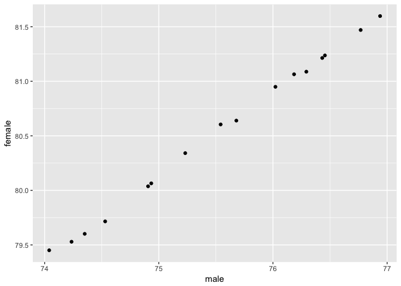

### Line plots

Let's add a line:

``` r
ggplot(life.usa, aes(x = male, y = female)) +
  geom_point() +
  geom_line()
```

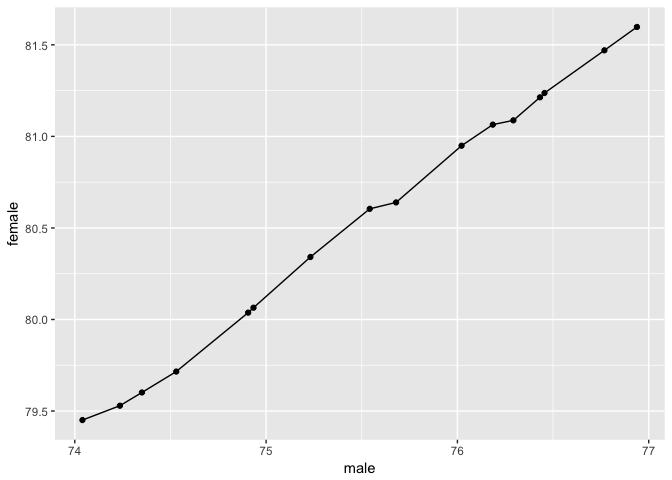

This is line that connects the points. But we might want to draw a fitted line instead. We can do this using the `geom_smooth()` layer rather than `geom_line()`:

``` r
ggplot(life.usa, aes(x = male, y = female)) +
  geom_point() +
  geom_smooth()
```

    ## `geom_smooth()` using method = 'loess'

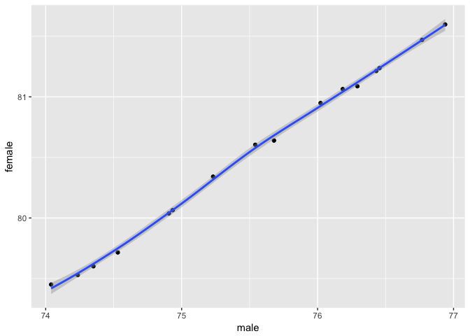

`geom_smooth()` by default uses a method called loess (local regression) to create the fitted curve. A more straightforward method for this data would be a straight-line, or a linear model. This is done using `method = lm` within the `geom_smooth()` layer. Also, you may have noticed a thin grey band around the line, the 95% confidence interval. We can remove this by setting `se = F` within `geom_smooth()`:

``` r
ggplot(life.usa, aes(x = male, y = female)) +
  geom_point() +
  geom_smooth(method = 'lm', se = F)
```

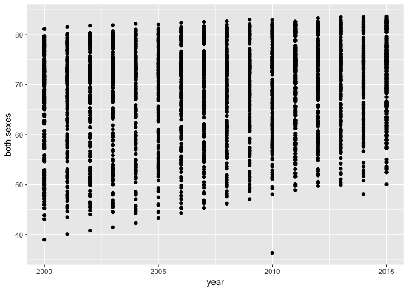

Now let's go back to the `life` dataframe of all countries. What if we wanted to plot the total (both sexes) life expectancy for every country by year?

``` r
ggplot(life, aes(x = year, y = both.sexes)) +
  geom_point()
```


Let's fit a line for each country.

``` r
ggplot(life, aes(x = year, y = both.sexes)) +
  geom_point() +
  geom_line() # what if I had run geom_smooth() instead?
```

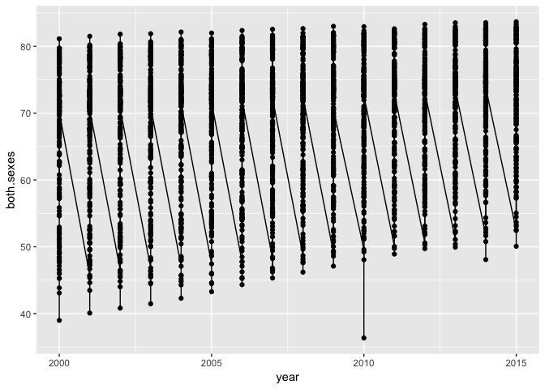

**Why didn't that work correctly?**

``` r
ggplot(life, aes(x = year, y = both.sexes, group = country)) +
  geom_point() +
  geom_line() 
```


The grey bands are standard error bands. In this case, they can be distracting, so we can remove them by setting `se = FALSE` in the `geom_smooth()` layer.

``` r
ggplot(life, aes(x = year, y = both.sexes, group = country)) +
#  geom_point() +
  geom_line() 
```

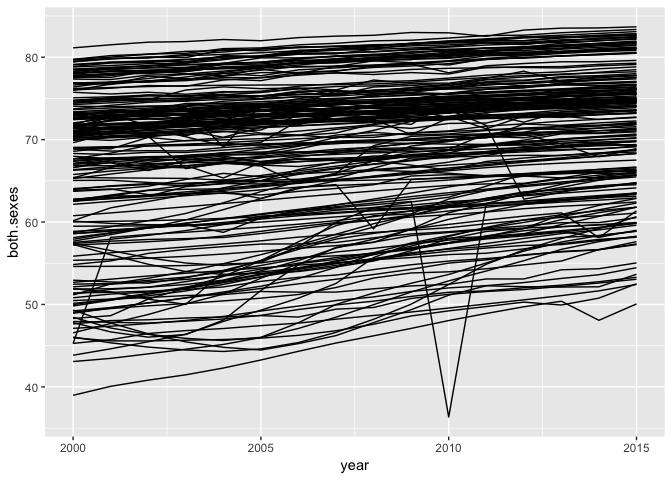

### Facetted plots

It's hard to see which country is which—especially the country whose life expectancy dipped below 40 in 2010. When we have so many countries, facetting is often a better way to explore the trends in the data. (Warning: the file will take a while to run, and you'll need to zoom in on the plot in R to see it more easily.)

``` r
ggplot(life, aes(x = year, y = both.sexes, group = country)) +
  geom_line() +
  facet_wrap(~ country)
```

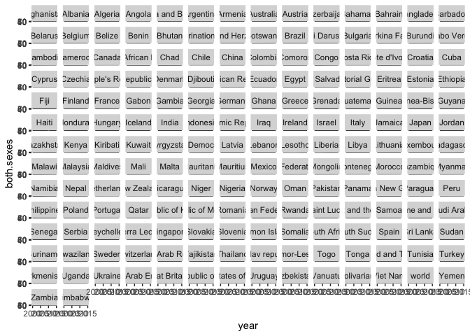

What do we see in this plot (the zoomed in one on RStudio, not the one you actually see above) that we can't see in the one before it? Note you wouldn't publish the above graph, but it's useful as an exploratory exercise.

### Reordering a plot

Haiti stands out. Take a look at the WHO metadata for life expectancy [here](http://apps.who.int/gho/data/node.wrapper.imr?x-id=65) as well as an alternative source, the [World Bank](http://data.worldbank.org/indicator/SP.DYN.LE00.IN?end=2015&locations=HT&start=2010&year_low_desc=true). Also [this paper](https://www.ncbi.nlm.nih.gov/pmc/articles/PMC2862993/) on the HIV epidemic and the 2010 earthquake in Haiti.

Let's see how Haiti in 2015 compares to the rest of the countries in the region. First, let's create a new dataframe, `americas`, for the countries within the Americas region.

``` r
americas <- life %>% filter(region == 'Americas' & year == 2015)
```

Now, let's plot all the countries in the Americas. We could use a bar graph for this, but since we've done scatter plots so far, let's try one now.

``` r
ggplot(data = americas, aes(x = both.sexes, y = country)) +
  geom_point()
```

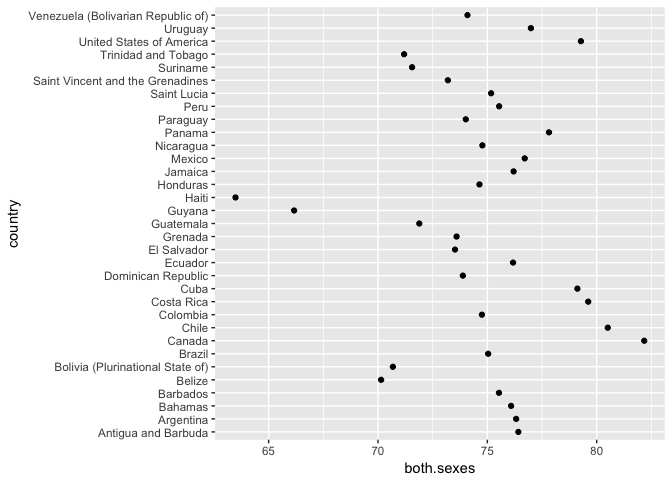

**Why didn't I put the countries on the x-axis?**

**What would make this plot look better?**

Right now, R is order from top to bottom in reverse alphbetical order. We want `ggplot2` to order the countries such the the country with the highest life expectancy appears first (on the top), and the country with the lowest appears last (on the bottom).

In order to do this, we need to have to create a *factor variable*. Factors are categorical variables, and they can be assigned levels that determine the order they are plotted.

To illustrate what I mean, I'll create a variable, `country.factor`, which is the factor version of the exisiting `country` variable:

``` r
class(americas$country) # a character
```

    ## [1] "character"

``` r
americas$country.factor <- as.factor(americas$country)
class(americas$country.factor) # a factor
```

    ## [1] "factor"

We can see the exist order of items in the factor variable, or the levels, using the `levels()` function:

``` r
levels(americas$country.factor)
```

    ##  [1] "Antigua and Barbuda"               
    ##  [2] "Argentina"                         
    ##  [3] "Bahamas"                           
    ##  [4] "Barbados"                          
    ##  [5] "Belize"                            
    ##  [6] "Bolivia (Plurinational State of)"  
    ##  [7] "Brazil"                            
    ##  [8] "Canada"                            
    ##  [9] "Chile"                             
    ## [10] "Colombia"                          
    ## [11] "Costa Rica"                        
    ## [12] "Cuba"                              
    ## [13] "Dominican Republic"                
    ## [14] "Ecuador"                           
    ## [15] "El Salvador"                       
    ## [16] "Grenada"                           
    ## [17] "Guatemala"                         
    ## [18] "Guyana"                            
    ## [19] "Haiti"                             
    ## [20] "Honduras"                          
    ## [21] "Jamaica"                           
    ## [22] "Mexico"                            
    ## [23] "Nicaragua"                         
    ## [24] "Panama"                            
    ## [25] "Paraguay"                          
    ## [26] "Peru"                              
    ## [27] "Saint Lucia"                       
    ## [28] "Saint Vincent and the Grenadines"  
    ## [29] "Suriname"                          
    ## [30] "Trinidad and Tobago"               
    ## [31] "United States of America"          
    ## [32] "Uruguay"                           
    ## [33] "Venezuela (Bolivarian Republic of)"

We want to reorder this factor variable such that the levels according to the `both.sexes` variable. The `forcats` package, another package by Hadley Wickham, makes it easy to to this using the `fct_reorder()` function. Let's create another variable, `country.factor.reorder`, for the reordered factor:

``` r
# install.pacakges('forcats') #if you don't already have forcats 
library('forcats') #load forcats package

americas$country.factor.reorder <- fct_reorder(americas$country.factor, americas$both.sexes)
```

We can check to see that `country.factor.reorder` is indeed reordered by using the `levels()` function on it:

``` r
levels(americas$country.factor.reorder)
```

    ##  [1] "Haiti"                             
    ##  [2] "Guyana"                            
    ##  [3] "Belize"                            
    ##  [4] "Bolivia (Plurinational State of)"  
    ##  [5] "Trinidad and Tobago"               
    ##  [6] "Suriname"                          
    ##  [7] "Guatemala"                         
    ##  [8] "Saint Vincent and the Grenadines"  
    ##  [9] "El Salvador"                       
    ## [10] "Grenada"                           
    ## [11] "Dominican Republic"                
    ## [12] "Paraguay"                          
    ## [13] "Venezuela (Bolivarian Republic of)"
    ## [14] "Honduras"                          
    ## [15] "Colombia"                          
    ## [16] "Nicaragua"                         
    ## [17] "Brazil"                            
    ## [18] "Saint Lucia"                       
    ## [19] "Barbados"                          
    ## [20] "Peru"                              
    ## [21] "Bahamas"                           
    ## [22] "Ecuador"                           
    ## [23] "Jamaica"                           
    ## [24] "Argentina"                         
    ## [25] "Antigua and Barbuda"               
    ## [26] "Mexico"                            
    ## [27] "Uruguay"                           
    ## [28] "Panama"                            
    ## [29] "Cuba"                              
    ## [30] "United States of America"          
    ## [31] "Costa Rica"                        
    ## [32] "Chile"                             
    ## [33] "Canada"

**How can we check that that worked?**

Now, instead of `y = country` in our `ggplot()` object, let's set `y = country.factor.reorder` and see what happens:

``` r
ggplot(data = americas, aes(x = both.sexes, y = country.factor.reorder)) +
  geom_point()
```

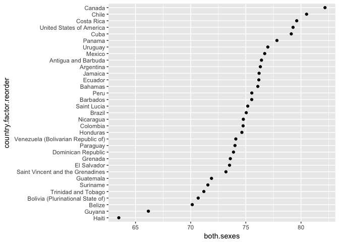

To save time (and once you're more familiar with factors and the `forcats` library), you can type `y = fct_reorder(country.factor, both.sexes)` within the `ggplot()` object itself.

Let's save the plot into an object called `p`:

``` r
p <- ggplot(data = americas, aes(x = both.sexes, y = fct_reorder(country.factor, both.sexes))) +
  geom_point()

p
```

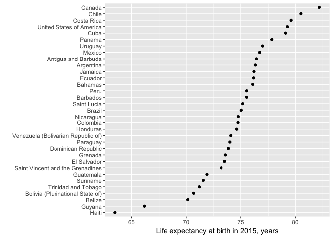

**Why didn't we need the dollar signs (e.g., `fct_reorder(americas$country.factor, americas$both.sexes)` this time)?**

### Axes labels and scales

We can change the x-axis and y-axis titles using the `labs()` layer:

``` r
p + labs(x = 'Life expectancy at birth in 2015, years', y = '')
```

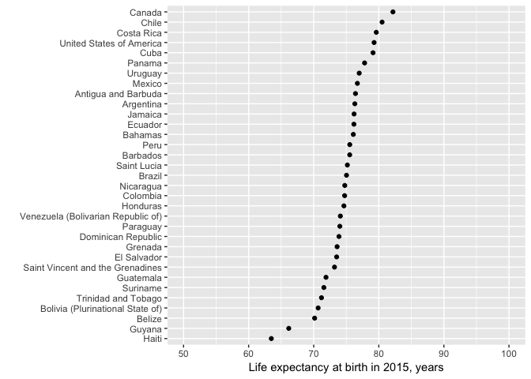

We can change the scale of the x-axis by adding a `scale_x_continuous()` layer. Let's say we want the x-axis to start at 50 and go to 100. We do this using `limits = c(60, 100)` within `scale_x_continuous()`:

``` r
p + labs(x = 'Life expectancy at birth in 2015, years', y = '') + scale_x_continuous(limits = c(50, 100))
```


That doesn't look too great. Let's set `limits = c(60, 85)` instead.

Maybe we want the x-axis labels to be every 5 years rather than every 10 years. We can add an argument to `scale_x_continuous()` called `breaks()` in order to do this. Note the use of the shortcut function `seq(from = 50, to = 100, by = 5)`:

``` r
p + labs(x = 'Life expectancy at birth in 2015, years', y = '') + 
  scale_x_continuous(limits = c(60, 85), # minimum and maximum for the x-axis 
                     breaks = seq(from = 60, to = 85, by = 5)) # x-axis labels
```

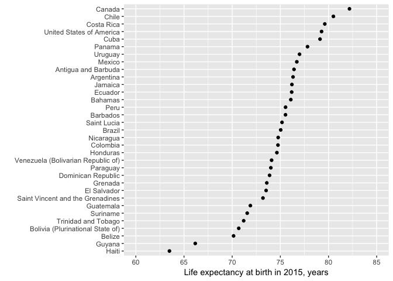

Maybe we want to remove the minor breaks, too. Let's go ahead and do that, as well as adding a title using the `ggtitle()` layer saving the plot as an R object called `plot1`:

``` r
# ?scale_x_continuous()
plot1 <- p + labs(x = 'Life expectancy at birth in 2015, years', y = '') + 
  scale_x_continuous(limits = c(60, 85),  # minimum and maximum for the x-axis 
                     breaks = seq(from = 50, to = 100, by = 5), # x-axis labels
                     minor_breaks = NULL) +
  ggtitle("Haiti's life expectancy is the lowest in the region") # why did I use double quotes here?

plot1
```

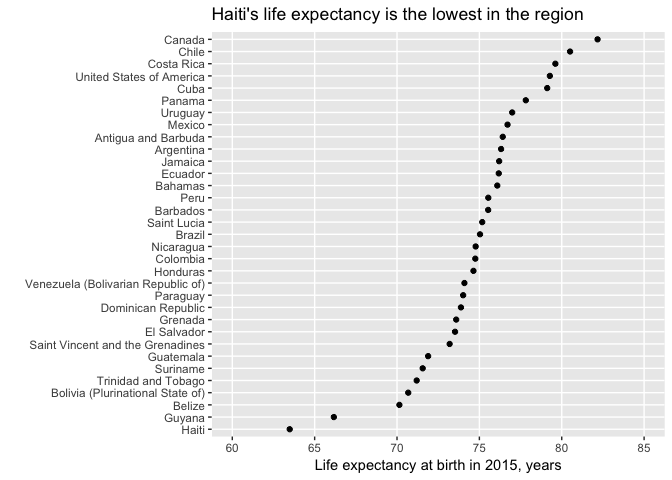

### Adjusting themes/appearance

We can further customize the look and feel of `plot1` using `theme` as well as the `ggthemes()` library:

More on these themes [here](http://ggplot2.tidyverse.org/reference/ggtheme.html) and [here](https://github.com/jrnold/ggthemes)

``` r
# plot1 + theme_bw()
# install.packages('ggthemes') # if you don't already have ggthemes
library('ggthemes') # load the ggthemes pacakge
plot1 + theme_few()
```

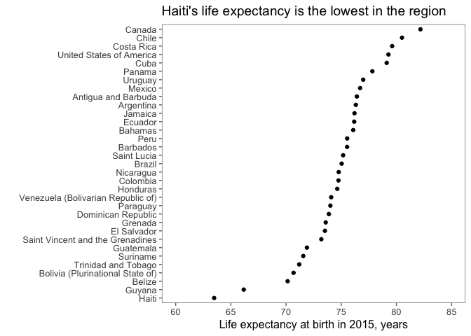

The above themes are pre-made themes. You can also do some customization with the `theme()` layer. For example,

``` r
plot1 + theme(panel.background = element_blank())
```


The `theme()` layer can be a bit tricky to figure out. Take a look at the "Theme elements" section of [this page](https://rstudio-pubs-static.s3.amazonaws.com/3364_d1a578f521174152b46b19d0c83cbe7e.html) to figure out the different parts.

### Saving a plot

Finally, we can save the plot using `ggsave()`:

``` r
ggsave('plot1.png', plot1 + theme_few())
```

    ## Saving 7 x 5 in image

``` r
ggsave('plot1.png', plot1 + theme_few(), width = 8, height = 6)
```

### Other attributes of ggplot: sizes, scales, colors

Let's use the `gapminder` package to load in a different slice of the life expectancy data, GDP per capita, and population by country. Find out more about Gapminder [here](http://www.gapminder.org/data/) and if you haven't seen it already, take some time to watch founder Hans Rosling's TED talk, ["The best stats you've ever seen"](https://www.ted.com/talks/hans_rosling_shows_the_best_stats_you_ve_ever_seen).

``` r
# install.packages('gapminder') # if you don't already have gapminder
library('gapminder') # load the gapminder package
gapminder
```

    ## # A tibble: 1,704 x 6
    ##        country continent  year lifeExp      pop gdpPercap
    ##         <fctr>    <fctr> <int>   <dbl>    <int>     <dbl>
    ##  1 Afghanistan      Asia  1952  28.801  8425333  779.4453
    ##  2 Afghanistan      Asia  1957  30.332  9240934  820.8530
    ##  3 Afghanistan      Asia  1962  31.997 10267083  853.1007
    ##  4 Afghanistan      Asia  1967  34.020 11537966  836.1971
    ##  5 Afghanistan      Asia  1972  36.088 13079460  739.9811
    ##  6 Afghanistan      Asia  1977  38.438 14880372  786.1134
    ##  7 Afghanistan      Asia  1982  39.854 12881816  978.0114
    ##  8 Afghanistan      Asia  1987  40.822 13867957  852.3959
    ##  9 Afghanistan      Asia  1992  41.674 16317921  649.3414
    ## 10 Afghanistan      Asia  1997  41.763 22227415  635.3414
    ## # ... with 1,694 more rows

**Exercise: create a scatter plot of GDP per capita in 2007 on the x-axis and life expectancy in 2007 on the y-axis and put it into an R object called `p`**

``` r
p <- ggplot(data = gapminder %>% filter(year == 2007), aes(x = gdpPercap, y = lifeExp)) +
  geom_point()

p
```


What if we wanted the size of the points to be equal to the population? We can use the size attribute in the `aes()` mapping function to do this.

``` r
p <- ggplot(data = gapminder %>% filter(year == 2007), aes(x = gdpPercap, y = lifeExp)) +
  geom_point(aes(size = pop))
```

An additional layer is required here, since we tend to perceive the size of points by area and not radius. Say we have cirlce 1 and circle 2. We want circle 2 to be twice as big as circle 1. In order to achieve this, we would want circle 2's *area* to be double the area of circle 2. If we set circle 2's *radius* to be twice as large, the area would be four times the area of circle 2 (since the area of a circle is proportional to the squared radius via pi \* r^2).

We accomplish this by adding a `scale_size_area()` layer.

``` r
p
```

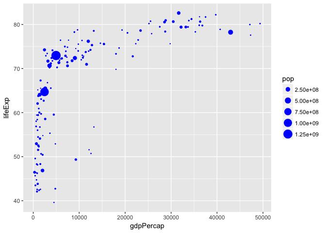

``` r
p + scale_size_area()
```


We could also color the plots according to continent by using the `color` attribute in the `aes()` function.

``` r
p <- ggplot(data = gapminder %>% filter(year == 2007), aes(x = gdpPercap, y = lifeExp)) +
  geom_point(aes(size = pop, color = continent))

p + scale_size_area()
```

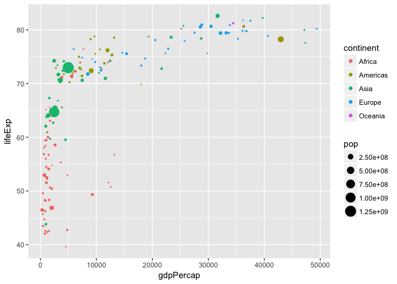

**What if we just wanted the colors of the points to be, say, blue rather than mapped to the `continent` variable?**

``` r
p <- ggplot(data = gapminder %>% filter(year == 2007), aes(x = gdpPercap, y = lifeExp)) +
  geom_point(aes(size = pop), color = 'blue')

p + scale_size_area(max_size = 10) # max_size = 10 sets the maximum size of the points (in this case, it makes them larger)
```

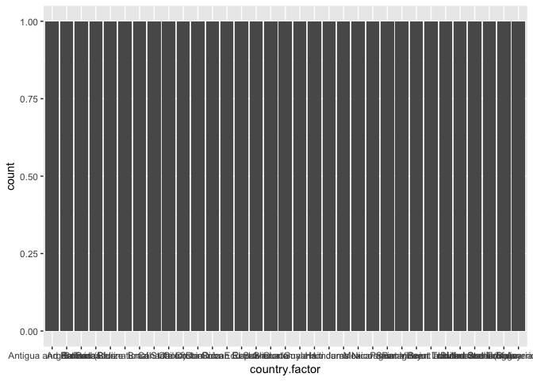

The difference between putting `color = ___` inside or outside of the `aes()` function is that placing it inside makes the color an aesthetic mapping—that is, a color *based on* another variable in the data (in our case, the `continent` variable), and placing int outside makes the color a value in its own right, not tied to a variable in the data (in our case, 'blue'). \[Here\]\](<http://www.stat.columbia.edu/~tzheng/files/Rcolor.pdf>) are some more colors in R. Note I added `max_size = 10` in order to make all the points a little bigger.

### The legend

Earlier, we talked about the `theme()` layer. Customizing the legend requires making additions to the `theme()` layer.

Take a look [here](https://rstudio-pubs-static.s3.amazonaws.com/3364_d1a578f521174152b46b19d0c83cbe7e.html) and see if you can figure out how to rename the legend "population" rather than "pop."

Sometimes it's nice to put the legend at the bottom rather than on the right, which is the default. This is another thing you can do within `theme()`:

``` r
p + scale_size_area(max_size = 10) + theme(legend.position = 'bottom')
```


In this case, I think the legend should actually go inside the plot, in the bottom right hand corner, since I have some empty space there. **Can you use [this page](https://rpubs.com/folias/A-simple-example-on-ggplot2-legend-options) to figure out how to do this?**

**Exercise: try to figure out how to make the population variable show up in non-scientific notation**

### Bar plots

Bar plots are another type of geometry that we can set using `geom_bar()` or `geom_col()`.

Let's go back to our 2015 data on country and life expectancy in the Americas, the `americas` dataframe.

Let's try to make it into a bar graph

``` r
ggplot(data = americas, aes(x = country.factor, y = both.sexes)) +
  geom_bar()
```

**Why didn't this work?**

Try this: (also `?geom_bar()`)

``` r
ggplot(data = americas, aes(x = country.factor)) +
  geom_bar()
```


``` r
ggplot(data = americas, aes(x = country.factor, y = both.sexes)) +
  geom_bar(stat = 'identity')
```


In order for the heights of the bars to represent values in the data, we need to either specify `stat = 'identity'` within the `geom_bar()` layer, or, better yet, just use `geom_col()`.

``` r
p <- ggplot(data = americas, aes(x = country.factor, y = both.sexes)) +
  geom_col()
```

We can flip the coordinates by adding `coord_flip()` as a layer:

``` r
p + coord_flip()
```

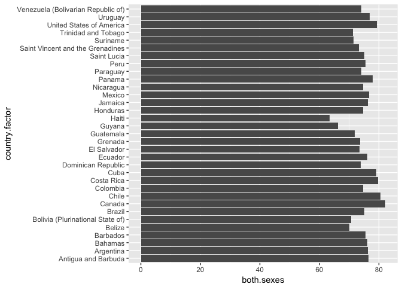

**Exercise: reorder the bars by life expectancy from highest to lowest using the `fct_reorder()` function in the `forcats` package**

### What else?

-   Change the look and feel of the bar graph above to your liking using the tools we've learned today and save it as a `.png` file.

-   What other visualizations could you make using the `gapminder` dataset?

-   What are some other customizations of `ggplot2` plots would you like to see that we haven't covered today (additional resources are in the GitHub repo: <https://github.com/underthecurve/r-dataviz-ggplot2>)
