**By [Christine Zhang](https://twitter.com/christinezhang) (ychristinezhang at gmail dot com and @christinezhang on Twitter)**     
*Data+Narrative Workshop at Boston University (June 7, 2018)*  
<br>

GitHub repository for Data+Code: https://github.com/underthecurve/r-dataviz-ggplot2

Data visualization is a popular aspect of R, since R can create sophisticated graphics with (relatively few) lines of code. In this class, we'll go through the basic data visualization functions of R.

In this workshop, we will:

- Go through a quick overview of some common graphic types
- Plot some common chart types in R

### Overview of common graphic types

What are some common chart types?

- bar plots
- line plots
- scatterplots
- histograms
- boxplots

When do you think you should (or should not) use each of these chart types? 

The *Financial Times* [Visual Vocabulary](https://github.com/ft-interactive/chart-doctor/tree/master/visual-vocabulary) is a good guide to different chart types and how to use them: https://github.com/ft-interactive/chart-doctor/tree/master/visual-vocabulary. The [Data Visualisation Catalogue](https://datavizcatalogue.com/index.html) by Severino Ribecca is another one: https://datavizcatalogue.com/index.html. Basically all the resources listed under [this blog post](https://xeno.graphics/articles/on-graphonyms-the-importance-of-chart-type-names/) by Maarten Lambrechts are great: https://xeno.graphics/articles/on-graphonyms-the-importance-of-chart-type-names/.

In this class, we'll mainly use R's built-in graphics tool to take a look at the above common chart types. The next class, "Advancing with data visualization in R using `ggplot2`", will provide an overview of [`ggplot2`](http://ggplot2.tidyverse.org/) (which stands for the "grammar of graphics"), a popular R package for visualizing data.

### Loading `tidyverse`

First, let's load the `tidyverse` package, which is a collection of R packages designed for doing data science.


```r
# install.packages('tidyverse') # if you don't already have tidyverse
library('tidyverse') # load the tidyverse package
```

### Today is June 7th, 2018. Let's take a look at the Boston weather on June 7th over the past decade or so.

Let's load in a data file, `boston_weather.csv`, of hourly Boston weather from 2007-2017, using the `read_csv()` command (part of the `tidyverse`). These historical weather figures have been obtained from Weather Underground. For more information on how I got the data from the website, see the `processing-weather-data.R` file. We'll call the dataframe `boston.weather`.


```r
boston.weather <- read_csv('boston_weather.csv')
```

```
## Parsed with column specification:
## cols(
##   time = col_time(format = ""),
##   temp = col_double(),
##   dewpoint = col_double(),
##   windspeed = col_double(),
##   precip = col_double(),
##   events = col_character(),
##   conditions = col_character(),
##   year = col_integer(),
##   month = col_integer(),
##   day = col_integer()
## )
```

We can take a look at the first six rows of `boston.weather` using `head()`:


```r
head(boston.weather)
```

```
## # A tibble: 6 x 10
##   time    temp dewpoint windspeed precip events conditions     year month
##   <time> <dbl>    <dbl>     <dbl>  <dbl> <chr>  <chr>         <int> <int>
## 1 00:54   54       39.9       8.1     NA <NA>   Clear          2007     6
## 2 01:54   53.1     39.9       9.2     NA <NA>   Partly Cloudy  2007     6
## 3 02:54   53.1     41         9.2     NA <NA>   Clear          2007     6
## 4 03:54   52       41         8.1     NA <NA>   Clear          2007     6
## 5 04:54   51.1     41         9.2     NA <NA>   Clear          2007     6
## 6 05:54   52       41         9.2     NA <NA>   Clear          2007     6
## # ... with 1 more variable: day <int>
```

### Bar plot

The `boston.weather` data provides hourly temperatures (note these are in 24-hour time and degrees Fahrenheit, respectively) for each year's June 7th. You can take a look for yourself on the Weather Underground webpage. For instance, here is the site URL for June 7, 2007:

https://www.wunderground.com/history/airport/KBOS/2007/6/7/DailyHistory.html?req_city=&req_state=&req_statename=&reqdb.zip=&reqdb.magic=&reqdb.wmo=

Here's a simple way to make a bar plot of the `temp` variable in the `boston.weather` -- every temperature in the data.


```r
barplot(boston.weather$temp)
```

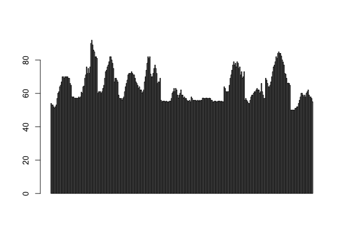<!-- -->

This is okay for a quick look, but it's not very informative. Each hour is on the x-axis and the temperature for that hour is on the y-axis. The data are plotted in the order that they appear in the dataframe.

Instead, let's plot just the highest temperature for each year. We will use the `dplyr` package (also included in the `tidyverse`) to do this. `dplyr` is a great tool for cleaning data in R. If you'd like to learn more about the syntax of `dplyr`, [here](https://github.com/underthecurve/r-data-cleaning-tricks) are the materials from my workshop last year, "Tricks for cleaning your data in R": https://github.com/underthecurve/r-data-cleaning-tricks

Let's call this new dataframe with the maximum temperatures between 2007 and 2017 `boston.weather.max`.


```r
boston.weather.max <- boston.weather %>% # the dataframe
  group_by(year) %>% # the grouping variable
  summarise(max.temp = max(temp)) # the variable we want: maximum temperature
```

We can take a look at the first six rows of `boston.weather.max` using `head()`:


```r
head(boston.weather.max)
```

```
## # A tibble: 6 x 2
##    year max.temp
##   <int>    <dbl>
## 1  2007     70  
## 2  2008     91.9
## 3  2009     82  
## 4  2010     73  
## 5  2011     82  
## 6  2012     63
```

Now let's try the `barplot` command again.


```r
barplot(boston.weather.max$max.temp)
```

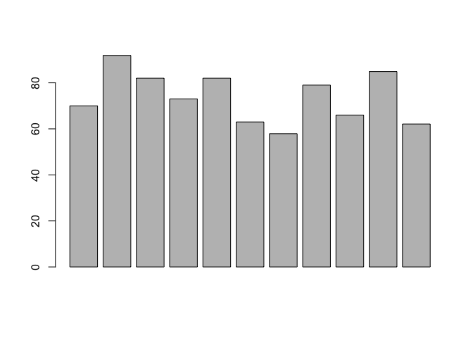<!-- -->

Notice how there are no x-axis labels, which is not particularly helpful in this case. We can add them using `names.arg = `:


```r
barplot(boston.weather.max$max.temp, 
        names.arg = boston.weather.max$year)
```

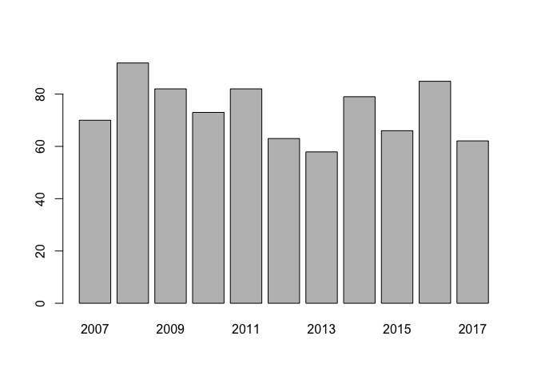<!-- -->

If you're like me, you may be bothered by the fact the y-axis labels end at 80, but the temperatures in the data don't. For example, in 2008, the max temperature was 91.9. We can adjust the y-axis limits using `ylim = `. Let's make the y-axis go up to 100:


```r
barplot(boston.weather.max$max.temp, 
        names.arg = boston.weather.max$year, 
        ylim = c(0, 100))
```

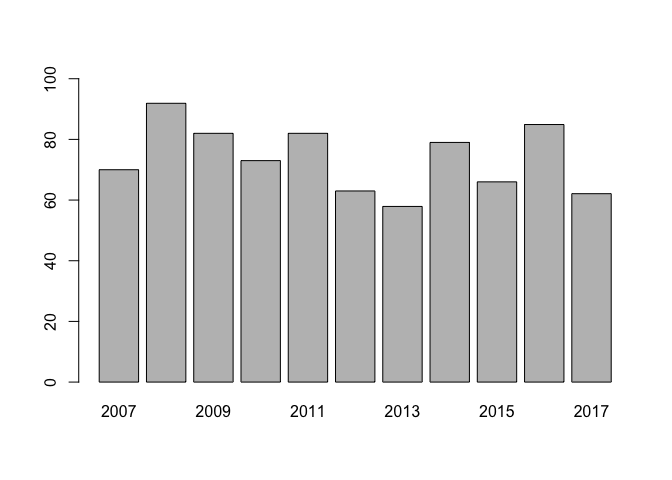<!-- -->

### Line plot

Since this is time trend data, a line rather than a bar plot might be a better way of visualizing it. We can use the `plot()` function to do this:


```r
?plot()
plot(x = boston.weather.max$year, 
     y = boston.weather.max$max.temp, 
     type = 'l')
```

<!-- -->

Let's add axis labels and a title.


```r
plot(x = boston.weather.max$year, 
     y = boston.weather.max$max.temp, 
     type = 'l', 
     xlab = 'year',
     ylab = 'temperature (in F)',
     main = 'Maximum temperatures in Boston on June 7th\n2007-2017\n')
```

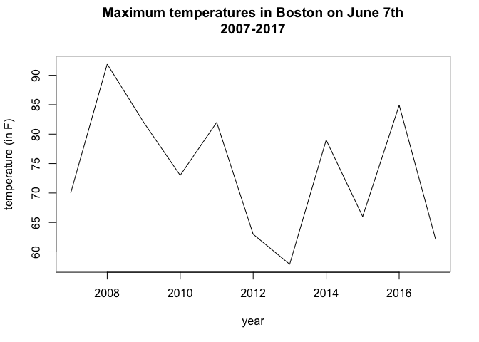<!-- -->

Line plots are nice because we can visualize multiple things on one chart. For example, let's create another dataframe, `boston.weather.min`, again using a set of functions powered by `dplyr`. This dataframe will include the lowest, or minimum, temperatures for each year. 


```r
boston.weather.min <- boston.weather %>% # the dataframe
  group_by(year) %>% # the grouping variable
  summarise(min.temp = min(temp)) # the variable we want: minimum temperature
```

**How can we inspect the first few rows of the `boston.weather.min` dataframe?**

Now let's add a line plot of minimum temperatures to our plot of maximum temperatures. Highlight the following code and run it all at once:


```r
plot(x = boston.weather.max$year, 
     y = boston.weather.max$max.temp,
     type = 'l', 
     xlab = 'year',
     ylab = 'temperature (in F)',
     main = 'Max and min temperatures in Boston on June 7th\n2007-2017\n')
lines(x = boston.weather.min$year, 
      y = boston.weather.min$min.temp)
```

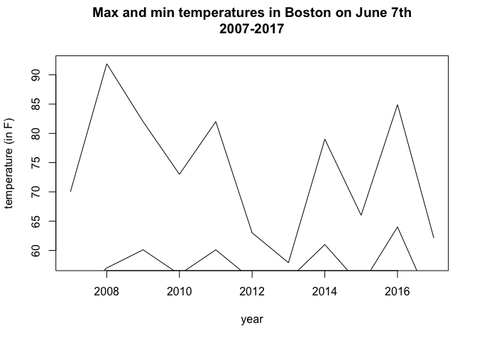<!-- -->

This plot is ... not great. Why not?

Let's fix the y-axis limits first. **How can we decide what these limits should be?**

Highlight the following code and run it all at once:


```r
plot(x = boston.weather.max$year, 
     y = boston.weather.max$max.temp,
     type = 'l', 
     xlab = 'year',
     ylab = 'temperature (in F)',
     main = 'Max and min temperatures in Boston on June 7th\n2007-2017\n',
     ylim = c(40, 100))
lines(x = boston.weather.min$year, 
      y = boston.weather.min$min.temp)
```

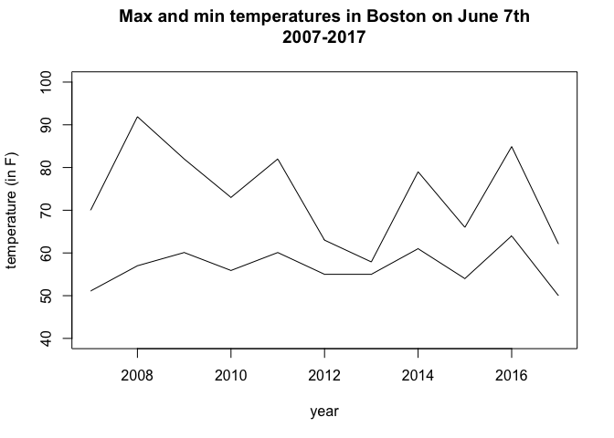<!-- -->

Maybe we also want the max and min to be different colors. We can do this with `col`. [Here's](http://www.stat.columbia.edu/~tzheng/files/Rcolor.pdf) a guide to how colors are named in R: http://www.stat.columbia.edu/~tzheng/files/Rcolor.pdf

Highlight the following code and run it all at once:


```r
plot(x = boston.weather.max$year, 
     y = boston.weather.max$max.temp,
     type = 'l', 
     xlab = 'year',
     ylab = 'temperature (in F)',
     main = 'Max and min temperatures in Boston on June 7th\n2007-2017\n',
     ylim = c(40, 100), 
     col = 'red')
lines(x = boston.weather.min$year, 
      y = boston.weather.min$min.temp,
      col = 'blue')
```

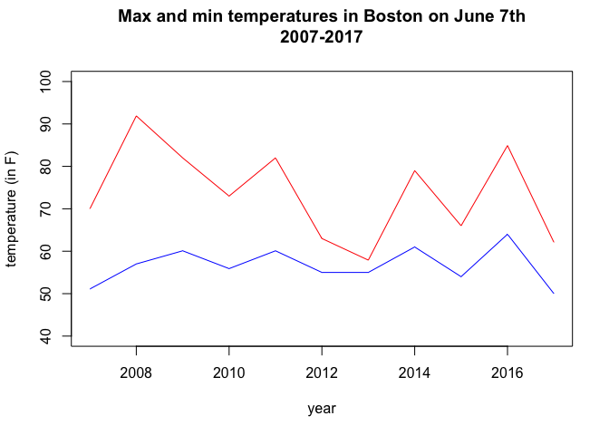<!-- -->

We can also add a legend to our plot but this is a bit cumbersome in base R, so I'd encourage you to stick around for the next class, "Advancing with data viz in R using ggplot2": https://github.com/underthecurve/r-dataviz-ggplot2/blob/master/R-advancing-with-dataviz.md

For now, let's take a look at the `legend()` function:


```r
?legend()
```

**What should the arguments inside of `legend()` be?**

Highlight the following code and run it all at once:


```r
plot(x = boston.weather.max$year, 
     y = boston.weather.max$max.temp,
     type = 'l', 
     xlab = 'year',
     ylab = 'temperature (in F)',
     main = 'Max and min temperatures in Boston on June 7th\n2007-2017\n',
     ylim = c(40, 100), 
     col = 'red')
lines(x = boston.weather.min$year, 
      y = boston.weather.min$min.temp,
      col = 'blue')
legend(2014, 100, 
       legend = c('Max', 'Min'),
       col = c('red', 'blue'), lty = 1)
```

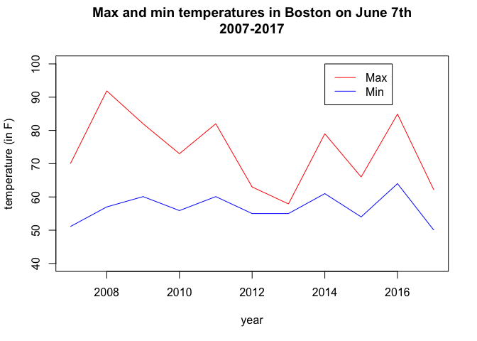<!-- -->

We might also want to create a scatterplot to see if there is a correlation between the lowest and highest temperature for each year. For example, do years with low minimum temperatures also have low maximum temperatures?

### Scatter plot

The `plot()` function by default creates a scatter plot.


```r
plot(x = boston.weather.min$min.temp, 
     y = boston.weather.max$max.temp)
```

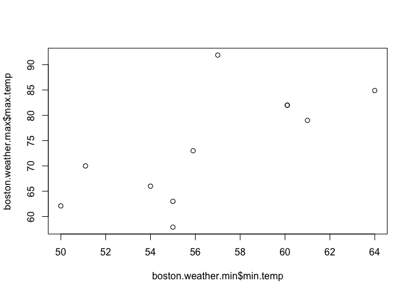<!-- -->

We can draw the straight line that best fits the relationship between these two variables. In order to do this, we can use `abline()`, a function that adds straight lines to a plot, in combination with an additional argument, `lm()`, which stands for "linear model." We have to tell R that `boston.weather.max$max.temp` is our y-variable (aka "outcome" variable) and `boston.weather.min$min.temp` is our x variable (aka "input" variable) for the regression.

Highlight the following code and run it all at once:


```r
plot(x = boston.weather.min$min.temp, 
     y = boston.weather.max$max.temp)
abline(lm(boston.weather.max$max.temp ~ boston.weather.min$min.temp))
```

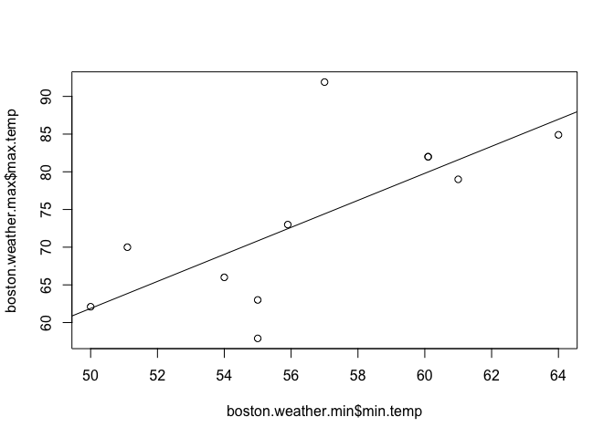<!-- -->

Here's one way to calculate the correlation coefficient between these two variables.


```r
cor(x = boston.weather.min$min.temp, 
     y = boston.weather.max$max.temp)
```

```
## [1] 0.7049562
```

We can also print out the regression output.


```r
summary(lm(boston.weather.max$max.temp ~ boston.weather.min$min.temp))
```

```
## 
## Call:
## lm(formula = boston.weather.max$max.temp ~ boston.weather.min$min.temp)
## 
## Residuals:
##      Min       1Q   Median       3Q      Max 
## -12.9355  -2.8148   0.2232   2.0267  17.4810 
## 
## Coefficients:
##                             Estimate Std. Error t value Pr(>|t|)  
## (Intercept)                 -27.7097    34.1317  -0.812   0.4378  
## boston.weather.min$min.temp   1.7917     0.6009   2.982   0.0154 *
## ---
## Signif. codes:  0 '***' 0.001 '**' 0.01 '*' 0.05 '.' 0.1 ' ' 1
## 
## Residual standard error: 8.171 on 9 degrees of freedom
## Multiple R-squared:  0.497,	Adjusted R-squared:  0.4411 
## F-statistic: 8.891 on 1 and 9 DF,  p-value: 0.0154
```
### Histogram

Now we have a sense of the minimum and maximum Boston temperatures on June 7th of each year, but what if we wanted to get a better sense of the distribution of temperatures?

Let's go back to the hourly data, `boston.weather`:


```r
head(boston.weather)
```

```
## # A tibble: 6 x 10
##   time    temp dewpoint windspeed precip events conditions     year month
##   <time> <dbl>    <dbl>     <dbl>  <dbl> <chr>  <chr>         <int> <int>
## 1 00:54   54       39.9       8.1     NA <NA>   Clear          2007     6
## 2 01:54   53.1     39.9       9.2     NA <NA>   Partly Cloudy  2007     6
## 3 02:54   53.1     41         9.2     NA <NA>   Clear          2007     6
## 4 03:54   52       41         8.1     NA <NA>   Clear          2007     6
## 5 04:54   51.1     41         9.2     NA <NA>   Clear          2007     6
## 6 05:54   52       41         9.2     NA <NA>   Clear          2007     6
## # ... with 1 more variable: day <int>
```

We could plot a histogram of `temp` using `hist()`, which would give a sense of the most common temperatures in the data.


```r
hist(boston.weather$temp)
```

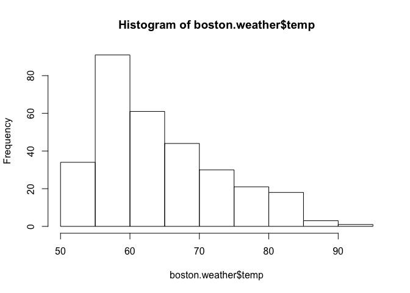<!-- -->

This is nice--we can see that most of the time on June 7th, hourly temperatures are in the 60 or so degree range.

**What if I wanted to see the distribution of temperatures by year?**

### Boxplot

I really like boxplots. [Here](https://www.khanacademy.org/math/statistics-probability/summarizing-quantitative-data/box-whisker-plots/a/box-plot-review) is a good article from Khan Academy that reviews what boxplots do: https://www.khanacademy.org/math/statistics-probability/summarizing-quantitative-data/box-whisker-plots/a/box-plot-review. Basically, boxplots provide a summary of the range of values: not only the min and the max, but also the first quartile, the median, and the third quartiles. [Here](https://www.nytimes.com/interactive/2018/06/05/opinion/columnists/what-college-really-costs.html) is a piece in the Opinion section of the *New York Times*, about the cost of college, with an excellent series of boxplots right up top: https://www.nytimes.com/interactive/2018/06/05/opinion/columnists/what-college-really-costs.html.

Let's make boxplots of the hourly temperature for each year.


```r
?boxplot()
boxplot(temp~year, 
        data = boston.weather)
```

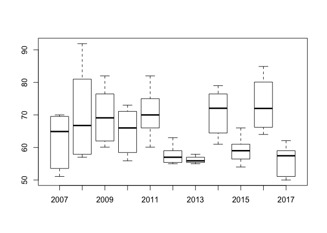<!-- -->

### A taste of `ggplot2`

If we have time, let's use a the built-in `Seatbelts` data of drivers killed by year in Great Britain to showcase `qplot()`, a function within the `ggplot2` data viz package.

Make the `data.seatbelts` dataframe:


```r
# Create a data frame 
data(Seatbelts)
data.seatbelts <- data.frame(Year = floor(time(Seatbelts)),
                  Month = factor(cycle(Seatbelts),
                               labels = month.abb), Seatbelts)
```

**How would you inspect the first few rows of `data.seatbelts`?**

`qplot()` stands for "quick plot" and is the quick and simple plotting function of `ggplot2`. 


```r
# Now, let's plot the data, using the basic plotting function of ggplot2 
qplot(data = data.seatbelts, 
      x = Year, 
      y = DriversKilled, 
      main = 'Drivers Killed by Year')
```

<!-- -->

Don't worry, we'll get more into what the data actually say in the next class. What do you see as some advantages to `ggplot2`?

### What else?

- How would you add axis labels and a title to the boxplot of hourly Boston temperatures?
- What are some positive aspects and limitations to the base R graphics package?
- Are there other chart types or data visualziation methods you are interested in exploring?
